# DZMM vNext 叙事规则集：本地优先、状态驱动的互动叙事平台

**状态：** Active — Phase 0 contract v2 与确定性雾港垂直切片已实现；真实模型、叙事 UI 与 Android 验收待推进
**日期：** 2026-08-17
**范围：** 只扩展 vNext 的 `World → WorldVersion → Run → RunState → Turn` 聚合；不读取、迁移或兼容 v0.x。

## 1. 产品定位与问题

DZMM vNext 是一个**本地优先、状态驱动的互动叙事平台**。TRPG 是其中一个重要玩法，而不是产品边界。玩家在 Mac 创建、导入和管理一个版本化世界，在 Mac 或已配对 Android 上游玩同一个固定版本的 Run；Python 是所有真实状态的唯一裁判，LLM 只负责叙事与受限意图提议。

目前的 vNext 聚合已经解决“一个世界、一个版本、一个运行态”的所有权问题，但其规则 contract 只覆盖地点、物品、事件和骰子，无法清晰表达章节、选择、角色路线、关系维度和多结局。若另建“剧情存档”或“恋爱模式存档”，会重新引入两套创建、删除、回滚和手机恢复语义。本规格以一套 `RunState` 和一条审计 Turn 链解决三类体验。

### 目标

1. 同一 WorldVersion 可声明 `trpg`、`story_adventure`、`relationship_drama` 或 `hybrid` 叙事规则集；创建 Run 后规则集不可漂移。
2. 玩家可完成“剧情冒险 + 多维关系 + 多结局”的完整本地闭环，且刷新、断线、回滚后状态仍可信。
3. 将**世界书（Lorebook）**与**角色卡（Character Card）**作为一等内容概念和互通入口，优先采用 SillyTavern 社区可理解的字段/格式，而不是用 DZMM 私有术语替代它们。
4. 任何 Flag、章节、路线、关系、资源、事件和结局变化都由 Python 通过受限 command 验证、应用、记录与回滚。
5. Android 保持 gameplay-only；Mac 保持世界、规则集、模型、配对和生命周期管理权。

### 非目标

- 不做酒馆式任意 prompt 预设、正则、脚本或可执行 World Info；未知外部字段可 escrow 保留，但绝不执行。
- 不做新的 Story/Relationship save 表、第二条创建路径或另一套删除/回滚 API。
- 不让 LLM 指定任意数值增减、跳章、改 Flag、锁结局，或绕过规则直接写数据库。
- 不在首个切片实现多人桌、云同步、公共网络直连、iOS，或完整 Galgame 编辑器。
- 不因为 clean-slate 而保留 legacy TRPG 数据/API/UI 的兼容层。

## 2. 用户体验与规则集

| 规则集 | 玩家体验 | Python 裁决重点 | LLM 可做 / 不可做 |
|---|---|---|---|
| `trpg` | 自由行动、检定、战斗、资源和事件 | 骰子、战斗、物品、事件谓词 | 描述场景、提出检定意图；不可判骰或扣血/加物品 |
| `story_adventure` | 章节、可见选择、线索、分支与多结局 | 选择合法性、章节门槛、Flag、结局 | 叙述选择结果、建议候选选择；不可跳章或设 Flag |
| `relationship_drama` | 多角色路线、好感/信任等关系、好/普通/坏/隐藏结局 | 关系事件、门槛、一次性/冷却、路线/结局 | 叙述关系后果、提议已定义关系事件；不可直接刷数值 |
| `hybrid` | 用 TRPG 行动探索故事，并以关系和剧情收束 | 三类已声明 command 的并集及交叉前置条件 | 同上；规则集只允许显式白名单，不是“全开模式” |

创建向导先让作者选择玩法重心和启用的规则集。`hybrid` 必须明确选中的子能力（例如“骰子 + 章节 + 关系”），以便在状态面板、模型提示和命令校验中保持可解释。世界编辑产生新的 WorldVersion；既有 Run 永远继续使用创建时固定的 definition 和 ruleset。

首期作者模板以三个可理解的示例解释差异：`齿轮城调查` 是 `trpg`（检定、追逐、库存）；`雾港` 是受限 `hybrid`（章节选择与两人关系，后续可接入检定）；`春花寮` 是 `relationship_drama`（日程事件、关系阈值、个人路线和多结局）。它们都只是不同的 WorldVersion definition，不产生不同种类的存档。

### 内容术语与互通边界

- **世界书（Lorebook / World Info）：** 条目式、上下文知识层。保留 `keys`、常驻、优先级、内容和来源；它不直接改变 RunState。用户可把条目显式提升为地点、角色、事件或线索定义，并创建新的 WorldVersion。
- **角色卡（Character Card）：** 角色人格、外观、背景、示例对话和世界书条目的内容载体。优先兼容 SillyTavern V3 JSON/PNG metadata；它不是运行中的关系数值或结局判定来源。
- **叙事规则集（Narrative Ruleset）：** DZMM 的确定性规则契约，定义哪些章节、关系事件、选择、资源规则和 endings 可被 Python 应用。它不是另一份世界书，也不是用户可执行脚本。

## 3. 首个可玩示例：双角色《雾港》

### 世界与人物

雾港被永不散去的灰潮包围。玩家在找回失踪航图、阻止港口沉没的三夜内，选择相信港卫 **岚** 或走私者 **沈砚**。导入的两张角色卡与港口世界书提供叙事；以下定义才是可运行的规则事实。

雾港首个 vertical slice 使用 `hybrid`，但只启用 `chapters`、`choices`、`relationships`、`endings` 和 `resources`；它有意不启用骰子/战斗。这样既真实验证三类体验的组合，又不把尚未迁入的 TRPG command 当成已交付能力。

| ID | 内容 |
|---|---|
| `lan` | 港卫。关系维度：`affection`、`trust`；路线 `lan_route`。 |
| `shen_yan` | 走私者。关系维度：`affection`、`trust`；路线 `shen_route`。 |
| `fog-lantern` | 关键资源；可在第一章获得。 |
| `chart-recovered`、`lan-kept-faith`、`shen-confessed`、`tide-gate-opened` | 关键 StoryFlag。 |

关系不是一个无限可刷的单值。雾港中每人有 `affection: 0..100` 与 `trust: -100..100`，初值都为 40/0；每个关系事件有前置条件、固定变化、原因、一次性键和冷却。每个章节同一对象最多触发一次“主动帮助”类事件；重复选择只得到叙事，不重复加分。

| 章节 | 玩家选择 / 引擎事件 | Python command 与确定性变化 |
|---|---|---|
| 第一章「潮雾抵港」 | 在灯塔救岚，或替沈砚藏起航图 | `choose_story_choice(rescue_lan)` → `set_story_flag(lan-rescued=true)`、`apply_relationship_event(lan-rescued)`：岚 `trust +20`、`affection +5`，once；或 `choose_story_choice(hide-chart)` → `set_story_flag(chart-stolen=true)`、`apply_relationship_event(shen-protected)`：沈砚 `trust +15`、`affection +8`，once。两条均可由 `grant_resource(fog-lantern)` 的已定义选择获得。 |
| 第一章结束 | 章节 exit 条件达成 | `advance_chapter(ch1-to-ch2)`：仅当第一章至少选择一项已 resolve；写入 `chapter_id=ch2`。 |
| 第二章「沉船的证词」 | 选择将证词交给岚，或深入黑市帮助沈砚 | `choose_story_choice(lan-testimony)` → `set_story_flag(lan-kept-faith=true)` + `apply_relationship_event(lan-truth)`（岚信任 +20；须 `lan-rescued`）；`choose_story_choice(shen-confession)` → `set_story_flag(shen-confessed=true)` + `apply_relationship_event(shen-confession)`（沈砚信任 +25、好感 +10；须 `chart-stolen`）。在满足路线门槛时 `lock_route(lan_route)` 或 `lock_route(shen_route)`；若均不满足，`lock_route(neutral_route)`。 |
| 第三章「潮门之夜」 | 用航图和雾灯开启潮门，或错失时机 | `resolve_story_event(open-tide-gate)`：前置 `chart-recovered=true`、持有 `fog-lantern`、路线未冲突；成功写 `tide-gate-opened=true`，失败只写已定义 `tide-gate-failed=true`，不让模型补判。 |
| 结局 | Python 在 chapter 完成时评估，按 priority 只命中一个 | `evaluate_endings(ch3-complete)` → 优先 `lock_ending(bell-beyond-fog)`（隐藏：两人 trust 均 >=60、资源齐全、`heard-the-bell`）；其次 `lock_ending(lan-dawn)` / `lock_ending(shen-low-tide)`（好：对应路线 + 开门 + 关系阈值）；再 `lock_ending(neutral-harbor)`（普通：`tide-gate-opened`）；最后 `lock_ending(fog-drowned)`（坏：`tide-gate-failed`）。所有判断均由 Python 的稳定 priority 完成。 |

模型可以在第一章提出“救岚似乎会让她愿意听你解释”的 `propose_intent`，或在 `lan-dawn` 已被锁定后叙述破晓；它不能发出 `trust +20` 或“现在进入好结局”的 command。若用户要求未定义的行动，Python 可接受为 `narrate_action`，但只允许产生未改变真实状态的叙事，或由预定义规则映射成候选选择/检定。

## 4. 领域与 schema 草案

以下是目标 contract 草案，不代表本次已修改的 JSON Schema。字段命名以稳定 API/存储为准，UI 一律使用“世界书/角色卡/章节/关系”等用户术语。

### 4.1 WorldDefinition 与 WorldVersion

```json
{
  "schema_version": 2,
  "name": "雾港",
  "content": {
    "lorebook": [{"id": "fog-custom", "title": "灰潮", "body": "...", "activation": "always", "priority": 90, "source": {"format": "world-info"}}],
    "character_cards": [{"id": "lan", "format": "sillytavern_v3", "source_payload": {"...": "preserved"}}]
  },
  "ruleset": {
    "id": "hybrid",
    "enabled_capabilities": ["chapters", "choices", "relationships", "endings"],
    "ruleset_version": 1
  },
  "story": {
    "chapters": ["...Chapter"],
    "flags": ["...StoryFlag definition"],
    "relationship_rules": ["...RelationshipEvent definition"],
    "endings": ["...EndingDefinition"]
  },
  "locations": [], "factions": [], "npcs": [], "events": []
}
```

`WorldVersion.definition` 是这个不可变 document；`WorldVersion.ruleset_id` 是从 definition 冗余索引出的不可变值，用于 Run 创建校验和快速查询。创建 Run 时将两者写入审计记录；请求不得覆盖它。

### 4.2 Chapter、StoryFlag 与 EndingDefinition

```json
{
  "chapter": {
    "id": "ch2", "title": "沉船的证词", "order": 2,
    "entry_conditions": [{"flag": "ch1-resolved", "equals": true}],
    "choices": [{"id": "lan-testimony", "when": [{"flag": "lan-rescued", "equals": true}], "effects": ["lan-truth"]}],
    "exit_conditions": [{"any_choice_resolved": true}],
    "next_chapter_id": "ch3"
  },
  "story_flag": {
    "id": "lan-kept-faith", "kind": "boolean", "default": false,
    "writers": ["choice:lan-testimony"], "visibility": "player"
  },
  "ending": {
    "id": "lan-dawn", "kind": "good", "priority": 100,
    "when": {"all": ["chapter=ch3", "flag:tide-gate-opened", "route=lan_route", "relationship:lan.trust>=60", "relationship:lan.affection>=45"]},
    "narrative_key": "ending.lan_dawn"
  }
}
```

`StoryFlag.writers` 是允许写入该 Flag 的声明式来源；`set_story_flag` 同时验证 command 来源与值域。`EndingDefinition` 只能读已验证的 RunState，不执行任意表达式；条件语法为有限 `all/any/not` 谓词树。
`EndingDefinition.kind` 固定为 `good`、`normal`、`bad` 或 `hidden`；同一 terminal checkpoint 只能锁定一个 ending。

### 4.3 RelationshipState

```json
{
  "relationships": {
    "lan": {
      "dimensions": {"affection": 45, "trust": 20},
      "route_eligible": true,
      "applied_events": {
        "lan-rescued": {"turn_id": "...", "reason_key": "relation.lan.rescued", "chapter_id": "ch1", "cooldown_until_turn": null}
      }
    }
  }
}
```

每个 relationship event 在 WorldDefinition 中声明 target、维度范围、变化量、原因 key、一次性 scope（`run` / `chapter` / `none`）、冷却回合、前置 Flag/资源/章节和可见性。`RelationshipState` 只记录由已应用事件得出的当前值及防重复 ledger；不能接受 `{"affection": 999}` 形式的通用写入。

### 4.4 RunState、TurnCommand 与 NarrativeIntent

```json
{
  "schema_version": 2, "revision": 12,
  "ruleset": {"id": "hybrid", "world_version_id": "wv_..."},
  "chapter": {"id": "ch2", "status": "active", "resolved_choice_ids": ["lan-testimony"]},
  "route": {"id": "lan_route", "status": "locked"},
  "flags": {"lan-kept-faith": true, "tide-gate-opened": false},
  "relationships": {"lan": {"dimensions": {"affection": 45, "trust": 20}, "applied_events": {}}},
  "resources": {"inventory": [{"id": "fog-lantern", "quantity": 1}]},
  "trpg": {"location_id": "...", "combat": null, "entities": {}, "events": {}},
  "ending": null
}
```

`TurnCommand` 是 Python 已验证、可重放的审计 command，含 `command_id`、`type`、`source`（`player` / `engine` / `system`）、声明式 `cause`、受限 payload、`before_revision` 和 outcome。LLM 的输出是另一份 `NarrativeIntent`（例如 `propose_choice`、`request_check`、`describe_outcome`），没有写状态权限；Python 仅在它映射到 definition 内的项目时，才产生 TurnCommand。客户端也不能直接 POST 任意 TurnCommand，只能提交玩家动作或一个当前可选 choice ID。

## 5. 状态机与回滚

```mermaid
stateDiagram-v2
  [*] --> ActiveChapter
  ActiveChapter --> ChoicePending: Python exposes eligible choices
  ChoicePending --> ActiveChapter: choose_story_choice rejected / unavailable
  ChoicePending --> EffectsApplied: choice accepted
  EffectsApplied --> ActiveChapter: relationship / flag / resource commands applied
  EffectsApplied --> NextChapter: exit conditions true
  NextChapter --> ActiveChapter: advance_chapter validates entry conditions
  EffectsApplied --> EndingCandidate: final chapter exit condition true
  EndingCandidate --> EndingLocked: evaluate_endings selects highest priority match
  EndingCandidate --> ActiveChapter: no terminal condition; defined fallback continues
  EndingLocked --> [*]
```



1. **章节与选择：** Python 依据 `chapter_id` 和有限条件计算可选项；选择提交需带当前 Run revision。接受后按 definition 固定顺序应用选择、Flag、资源、关系和事件 command，全部成功才创建 Turn 和新快照。
2. **关系：** `apply_relationship_event` 先校验目标角色、维度、前置条件、一次性 ledger 与冷却，再应用定义的 delta 和 reason key。非法、重复或冷却中的事件不改变 revision。
3. **结局：** 仅在 terminal checkpoint 或明确完成命令时执行 `evaluate_endings`。Python 按 `priority`、再按稳定 ID 排序选唯一 ending，随后 `lock_ending`；已锁 Run 不再接受改变真实状态的 gameplay command，只允许回看/导出。
4. **回滚：** 回滚不是删除历史，而是创建一个新的 `rollback` Turn，指向目标 Turn 的 `after_state` 快照并增加 revision。它会解除较晚的路线/结局锁定、恢复较早的冷却/once ledger 和可选项；不会改 WorldVersion/ruleset，也不会调用模型生成“补偿状态”。重放从目标快照开始，旧分支仍可审计但不再是 active state。

## 6. Python command 矩阵

`✓` 表示该 ruleset 可启用的 Python command；`条件` 表示须在 WorldDefinition 显式声明，`—` 表示 reject。所有 command 都记录 cause、actor、definition ID、before/after revision 与 outcome。

| Command | TRPG | 剧情冒险 | 关系叙事 | 混合 | 说明 |
|---|:---:|:---:|:---:|:---:|---|
| `narrate_action` | ✓ | ✓ | ✓ | ✓ | 只记录玩家行动/叙事，不直接改真实状态。 |
| `offer_choices` | 条件 | ✓ | ✓ | ✓ | Python 根据当下状态暴露定义内 choice。 |
| `choose_story_choice` | — | ✓ | ✓ | ✓ | 只能选择当前 eligible choice，触发声明 effects。 |
| `advance_chapter` | — | ✓ | ✓ | ✓ | 仅 system，在 exit/entry predicates 都为真时执行。 |
| `set_story_flag` | 条件 | ✓ | ✓ | ✓ | 仅定义的 writer/cause 可写。 |
| `lock_route` | — | 条件 | ✓ | ✓ | 仅达到定义的路线阈值时锁定。 |
| `apply_relationship_event` | — | 条件 | ✓ | ✓ | 固定 deltas + reason + once/cooldown；没有通用调值。 |
| `evaluate_endings` / `lock_ending` | 条件 | ✓ | ✓ | ✓ | system-only；Python 有限谓词判定。 |
| `roll_dice` / `resolve_check` | ✓ | 条件 | 条件 | ✓ | Python RNG/规则决定结果；剧情可用来开 choice。 |
| `move` / `set_entity_state` | ✓ | 条件 | 条件 | ✓ | 仅 definition ID/合法转移。 |
| `inventory_change` / `grant_resource` | ✓ | ✓ | ✓ | ✓ | 数量和来源均被定义限制。 |
| `start_combat` / `resolve_combat` | ✓ | — | — | 条件 | 由 TRPG capability 声明；不是关系结局捷径。 |
| `rollback` | ✓ | ✓ | ✓ | ✓ | 新审计 Turn；恢复历史快照，ruleset 不变。 |

## 7. UI 与 Android 影响

### Mac / Vue / Tauri（authoring + host）

- **创建向导：** 选择“TRPG / 剧情冒险 / 关系叙事 / 混合”，以能力说明替代技术名词；创建 `hybrid` 时逐项选能力。导入页明确区分“角色卡”“世界书”，展示 supported / preserved / ignored 字段，并要求确认后才生成 WorldVersion。
- **世界中心：** 每个 WorldVersion 显示 ruleset、世界书条目、角色卡来源、章节/关系/结局定义摘要及 Run 使用数；编辑生成新 version，不修改活跃 Run。
- **跑团页：** 输入区依据规则集展示 Do / Say / Story 与 Python 已开放的 choice。状态面板按渐进披露显示当前章节、路线、可见 Flag、线索/资源、每位角色的关系维度及“为何变化”的审计时间线；隐性条件不会泄漏。
- **结局页：** 只在 `ending.locked` 后展示结局类别、达成关键事实、可回看的 Turn 与“回滚到选择前”操作；不提供直接改数值的 debug 控件给普通玩家。
- **错误与恢复：** revision conflict、冷却、无效 choice、已锁结局都用可理解原因提示，刷新后重新取 RunState 与可选项，不能凭前端缓存继续提交。

### Android（gameplay-only）

- Android 只呈现已配对 Host 的 Run 列表、叙事、可选行动、可见状态、关系变化理由、结局和恢复状态；没有世界书编辑、角色卡导入、规则集选择、模型配置、归档/删除或配对批准权限。
- 手机用触控优先的“故事卡 + 选择按钮 + 轻量状态抽屉”：章节进度、角色关系、线索/资源在一屏可扫读，展开后才显示变化原因与历史；视觉可借鉴 Tavo/Saylo 的沉浸节奏，但 API 仍是 Host 的受限 command 契约。
- SSE 恢复后以 server revision 重新 hydration；若 choice 已因其他提交、回滚或 ending lock 失效，客户端丢弃本地候选并展示当前状态。

## 8. 成熟度矩阵调整与证据

文档设计本身不增加现有 **58.0/100** 分。实现启动时，当前 scorecard 应升级为以下平台矩阵并重新建立零继承的 feature evidence；历史的 TRPG 长局证据只能在仍覆盖同一能力时复用，不能推断剧情/关系/结局已经完成。

| 维度 | 权重 | P0 门槛 | 80 分验收证据 | 85 分验收证据 |
|---|---:|---:|---|---|
| 聚合、版本与生命周期 | 15 | 80 | WorldVersion 固定 ruleset；compose/archive/purge/rollback 临时 DB 覆盖，零孤儿。 | 打包桌面反复 create/edit-version/play/archive/recover，含失败注入。 |
| 状态裁决与 command 安全 | 20 | 80 | 非法 LLM/client command、任意关系调值、非法 Flag/跳章/结局均 fail-closed；审计与回滚测试。 | 真实模型长局中命令与 revision 100% 可重放，故障/断线无半回合。 |
| 剧情、关系与结局完整性 | 15 | 80 | 雾港 3 章、2 路线、好/坏/隐藏 ending 的 deterministic E2E；once/cooldown/reason/阈值覆盖。 | Huihui 14B 至少 30 回合、覆盖每个 ending 与回滚分支的人工可玩验收。 |
| 内容互通与作者体验 | 10 | 80 | ST V3 卡 + World Info 导入/报告/保留未知字段；世界书提升为实体产生新 version。 | Mac 打包应用完成导入→编辑→导出 round-trip，用户能在 3 分钟开始雾港。 |
| 模型与流鲁棒性 | 10 | 80 | Ollama、LM Studio/OpenAI 兼容探针，HTTP 200 error、空流、429、取消均不提交。 | Huihui 14B 多次故事/关系回合，意图拒绝与叙事降级可解释。 |
| 桌面 UX 与无障碍 | 10 | 80 | 打包 Mac 完成创建→选择→关系变化→结局→回滚→刷新；键盘主路径。 | 屏幕阅读与截图评审覆盖空态、失败、锁结局、恢复，零 P0 旅程缺陷。 |
| Android gameplay 恢复 | 10 | 80 | 真实 Android 在 LAN 完成配对、Run recovery、选择/状态/结局、SSE 断线恢复。 | 两个网络环境、Mac 重启、撤销、冲突提交和 30 回合 Huihui 实机旅程通过。 |
| 长局性能 | 5 | 80 | 50 回合/500 消息重开及剧情状态大小预算，状态无损。 | 100 回合混合模式断线 soak，目标设备流式与恢复预算达标。 |
| 工程与发布 | 5 | 80 | fresh DB migration、contract/后端/前端测试、诊断导出通过。 | 签名 Mac/Android RC、发布清单、P0 缺陷为零。 |
| **总计** | **100** | **每个 P0 >=80** | — | **加权 >=85，且无 P0 defect** |

## 9. 分阶段实施 Plan

| 阶段 | 交付物 | 退出门槛 |
|---|---|---|
| 0. Contract freeze | ADR 批准；`WorldDefinition` / `RunState` / `TurnCommand` v2 schema；雾港 fixture；scorecard 改版。 | schema lint、有限谓词/command 白名单设计评审通过；不改 legacy。 |
| 1. 最小可玩垂直切片 | 受限 `hybrid`（仅剧情冒险 + 关系能力）的雾港：3 章、两路线、多维关系、once/cooldown、好/坏 ending、回滚；Mac 最小 UI。 | 确定性 E2E 覆盖四种路线结果、非法写入拒绝、刷新/回滚正确；相关三维各 >=65。 |
| 2. 真实模型与作者闭环 | 模型仅提意图的 adapter、叙事 prompt、角色卡/世界书导入到雾港、结局页和审计 UI。 | Huihui 14B 30 回合含一次回滚；导入→开局→结局 packaged Mac 证据；相关 P0 >=80。 |
| 3. TRPG 规则集接入 | 将既有骰子、资源、地点、事件、战斗 command 迁入同一 v2 白名单；`trpg` 不携带剧情特有字段。 | TRPG regression、同 aggregate rollback、规则集越权拒绝。 |
| 4. Hybrid | 声明式 capability 组合、TRPG 检定影响章节/关系的预定义桥接规则、冲突检测和可视化。 | 50 回合 hybrid 实跑、交叉条件/ending/replay E2E；不出现第二存档模型。 |
| 5. Android 与 RC | gameplay-only 的章节/选择/关系/结局体验、LAN/断线/撤销实机矩阵、长局性能与打包。 | 矩阵总分 >=85、所有 P0 >=80、无 P0 defect。 |

### 需要确认的开放项

1. “普通结局”是每条角色路线的 fallback，还是独立 neutral route？雾港第一期采用独立 `neutral_route`，避免把达不到门槛误叙述成角色路线成功。
2. 首期关系维度固定为 `affection` 与 `trust`，还是作者可从受限词表增加 `respect` / `fear` / `hostility`？建议首期允许每角色声明 2–4 个有边界的维度，但 UI 默认只突出两个主维度。
3. 隐藏结局的条件对玩家是否展示为“未知条件”而非完全不可见？建议仅在结局后展示已满足/未满足的线索摘要，规则细节由世界作者决定。
